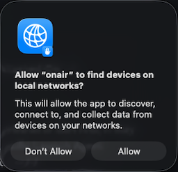

# ONAIR 🎙️🚨


**onair** is an application for interacting with IoT devices. Along with manual control, this application can detect whether the systems camera or microphone are enabled and turn on an indicator light. 

This app can be deployed as a User Agent (launchd LaunchAgent) to run on an interval.

## Dependencies
-  macOS Monterey 12.7+
- [homebrew](https://brew.sh/) => `/bin/bash -c "$(curl -fsSL https://raw.githubusercontent.com/Homebrew/install/HEAD/install.sh)"`
- [go](https://go.dev) => `brew install go`
- [make](https://en.wikipedia.org/wiki/Make_(software)) => Generally included with unix like operating systems
- [Home Assistant](https://www.home-assistant.io/) => with a compatible [device](https://www.home-assistant.io/integrations/) (light, outlet, or switch recommended)

## Getting Started
1. Add `$HOME/.local/bin/` to your $PATH
    ```sh
    # zsh
    echo "export PATH=\"\$PATH:$HOME/.local/bin\"" >> "$HOME/.zprofle"

    # bash
    echo "export PATH=\"\$PATH:$HOME/.local/bin\"" >> "$HOME/.bash_profile"
    ```
1. Checkout the repo and build the binary:
    ```sh
    make build
    ```
1. Create your config file
    ```sh
    onair config --create
    ```
1. Set your home assistant config values
    ```sh
    onair config -e "$HASS_ENDPOINT" -t "$HASS_TOKEN" -d "$HASS_DEVICE"
    ```
1. Check the status
    ```sh
    onair --status
    ```

## Services

- [Config](#config)
- [Home Assistant](#home-assistant)
- [User Agent](#user-agent)
- [Environment Variables](#environment-variables)
- [Logging](#logging)

### Config
**onair** uses a configuration file. Run `onair config` to see the config options.

The configuration file holds values for interfacing with Home Assistant, as well as configuration settings for what triggers the actions.

The default path for the config file is `$HOME/.onair/onair.cfg`

To specify a configuration file, set the environment variable `ONAIR_CONFIG_FILE_PATH` at runtime.

You can have multiple config files. Why would you want more than one config file? Let's say that you want two devices to turn on under different circumstances? Configuration files are 1:1 with IoT devices, so each device would require it's own config file. Below is an example:

```bash
# Turn on device a
ONAIR_CONFIG_FILE_PATH=$HOME/.onair/device-a.cfg onair -o
# Turn off device b
ONAIR_CONFIG_FILE_PATH=$HOME/.onair/device-b.cfg onair -f
```

| VALUE                   | TYPE     | DESCRIPTION                                 |
|-------------------------|----------|---------------------------------------------|
| home_assistant_url      | string   | Home Assistant (HASS) endpoint URL          |
| home_assistant_token    | string   | Home Assistant (HASS) API token             |
| home_assistant_entity   | string   | Home Assistant (HASS) entity name           |
| onair_enable_camera     | boolean  | Enable camera detection (true/false)        |
| onair_enable_microphone | boolean  | Enable microphone detection (true/false)    |
| scheduler_cron_interval | string   | (optional) cron scheduler for user agent ("* * * * *") |


#### Encryption
Configuration files can be encrypted to protect secrets. Set the encryption key with the environment variable `ONAIR_CONFIG_ENCRYPTION_KEY` - this is a string. If an encryption key is not provided, configuration files will not be encrypted.

The key should be an AES key, either 16, 24, or 32 bytes to select AES-128, AES-192, or AES-256.

Keygen:
```bash
BYTES=32
ONAIR_CONFIG_ENCRYPTION_KEY=$(openssl rand -hex $BYTES)
```

### Home Assistant
Home Assistant (HASS) serves as the IoT backbone of this project. A pre-configured HASS instance is required.

1. Add the necessary Home Assistant [integration](https://www.home-assistant.io/getting-started/integration/) for your device.
    - Capture the [`entity_id`](https://www.home-assistant.io/docs/configuration/customizing-devices/) you wish to control
1. Create a Home Assistant [Long Lived Access Token](https://developers.home-assistant.io/docs/auth_api/#long-lived-access-token)

Add the `home_assistant_url`, `home_assistant_token`, and `home_assistant_entity` to your config.

Once configured, run `onair hass` to see hass options.

### User Agent

Schedule **onair** to run as a user agent.

The file `local.onair.plist` contains an interval in seconds:
```
    <key>StartInterval</key>
    <integer>30</integer>
    <key>RunAtLoad</key>
```
Set this value to your desired interval.

> **NOTE:** in `local.onair.plist` you will also see two placeholder values: !HOME! and !USER! - these are replaced by the make command to install the user agent. 

Then run `make launchd-load` to load the service.

If you want to load the service at the top of the next minute to ensure your interval aligns with the minute, run `make launchd-interval`

Run `make launchd-unload` to remove the launch agent.

#### Allow Network Access
You will need to allow the binary to access devices on your local network. 

When the following pop-up appears, click allow.



#### Scheduler
The user agent allows **onair** to run on an interval, such as every 30 seconds. Sometimes, the desired behavior is to only have the this interval apply during certain time windows, like during the workday (MON-FRI between 9am-5pm).

<!-- TODO: CONFIG VALUE NAME! -->
This can be accomplished with the optional config value of `scheduler_cron_interval`. With a schedule set, the agent will still run on it's fixed interval. At runtime, it evaluates this cron-style schedule to determine whether work is allowed at that time.

The schedule does not control execution frequency; it defines _time windows during which the agent may perform actions_. On each wake-up, the agent checks whether the current time falls within an allowed window and either proceeds or exits.

Using the above workday example, the config value would be as follows:
```cron
# Every minute during business hours (9:00 AM - 4:59 PM)
# Monday through Friday

# every minute (*)
# of hours 9 AM through 4 PM (9-16)
# on every day of the month (*)
# every month (*)
# on day of week MON-FRI (1-5)

scheduler_cron_interval="* 9-16 * * 1-5"
```

> Need help with cron scheduling? Check out [crontab.guru](https://crontab.guru) or [crontab.cronhub.io](https://crontab.cronhub.io)

### Environment Variables
| service | env var | type | default |
|---------|---------|------|---------|
| config  | `ONAIR_CONFIG_FILE_PATH` | string(Path) | `$HOME/.onair/onair.cfg` |
| config  | `ONAIR_CONFIG_ENCRYPTION_KEY` | string(16, 24, or 32 bytes) | null |
| logger  | `ONAIR_LOG_FILEPATH` | string(path) |  `$HOME/.onair/onair.log` |

### Logging
**onair** writes log files to `$HOME/.onair/onair.log`. The logs self-rotate, and auto cleanup after enough time passes.

The log location can be changed with the `ONAIR_LOG_FILEPATH` env var.
